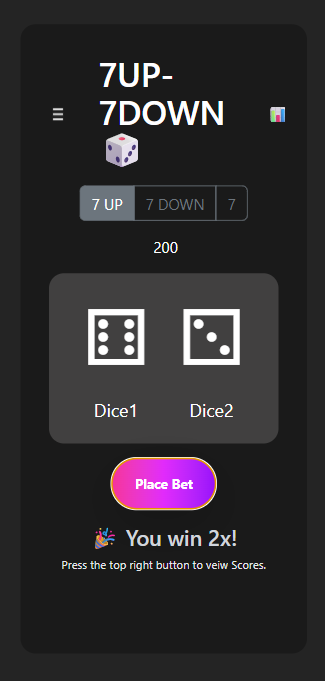
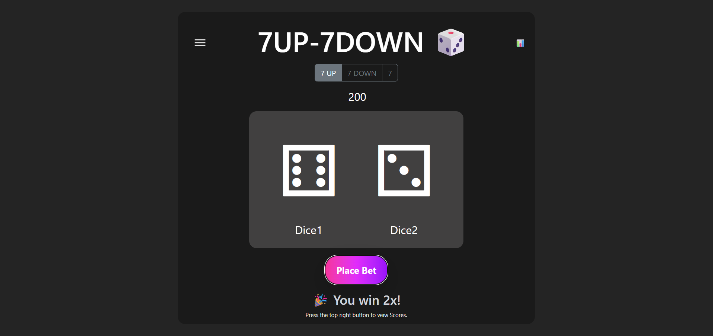
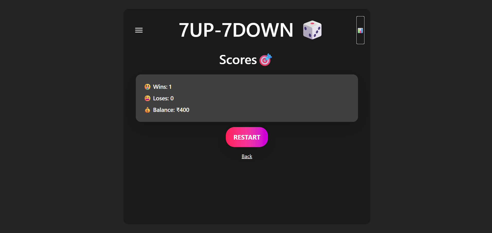

# 🎲 7Up 7Down – A React Game of Luck & Logic

**7Up 7Down** is a quick, fun number prediction game built with **React**, styled using **Tailwind CSS** and **React-Bootstrap**. Predict whether a randomly generated number between 1 and 13 will be **less than 7**, **exactly 7**, or **greater than 7**. It’s addictive, mobile-friendly, and great for chilling between coding sessions 😌🎮

---

## 🔗 Live Demo

🌐 [Play it now on Vercel](https://7-up-7-down-game-two.vercel.app/)  

---

## ✨ Features

- 🎯 **Simple Gameplay** – Just choose 7Down, 7, or 7Up
- 🔄 **Random number generation** (1 to 13)
- 🧠 **Instant feedback** – See if your guess was right
- 🧾 **Score Tracking** – Real-time **Wins**, **Losses**, and **Balance**
- 📜 **Slide-out Drawer** – Shows clear **Game Instructions** (perfect for new players)
- 📊 **Dedicated Score Page** – View your game stats in style
- 💅 **Clean UI** with **React-Bootstrap + Tailwind**
- 📱 **Fully responsive** – Looks great on mobile, tablet, and desktop
- 🌈 Lightweight and fast (pure frontend)

---

## 📸 Screenshots

### 📱 Mobile View  


### 💻 Desktop View  


### 📜 Drawer with Game Instructions  


### 📊 Score Page  


> Don’t forget to add these images in the `screenshots/` folder when you push to GitHub!

---

## 🧱 Tech Stack

- **React** – Component-based UI
- **Tailwind CSS** – Utility-first styling
- **React-Bootstrap** – Responsive components
- **JavaScript** – Game logic
- **Vite** – Fast build tool (if used)

---

## 🕹️ How to Play

1. Click on any of the 3 buttons:
   - **7Down** → Predict number < 7  
   - **7** → Predict number = 7  
   - **7Up** → Predict number > 7  
2. App generates a random number (1–13)
3. You'll instantly know if you were **Right or Wrong**
4. Your **scoreboard updates** live:
   - ✅ **Wins**
   - ❌ **Losses**
   - 💰 **Balance**
5. Use the **slide-out drawer** to view game instructions anytime
6. Open the **Score Page** to review your performance

---

## 🚀 Getting Started (Local Setup)

```bash
git clone https://github.com/your-username/7up-7down.git
cd 7up-7down
npm install
npm run dev
